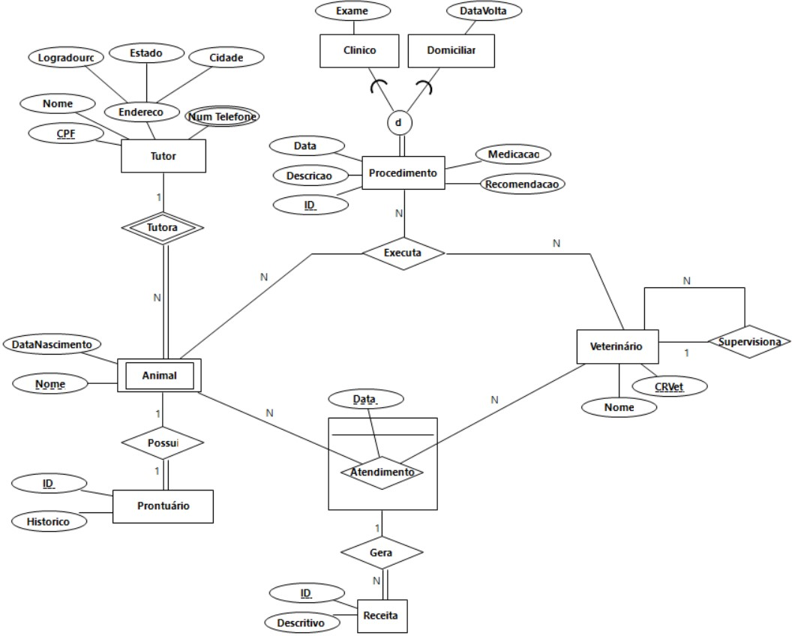

<p align="center">
  <a href="https://portal.cin.ufpe.br/">
    
  </a>

  <h3 align="center">Projeto de Banco de Dados - 23.1</h3>

  <p align="center">
    <i>This is a full database project, starting from conceptual and going all over to the physical implementation in Oracle, passing throught the logical phase. Its related to an Veterinary Clinic system.</i>
    <br>
    <br>
    <i>By: <a href="mailto:lfs@cin.ufpe.br">Lucas Florêncio</a>, <a href="mailto:lrbf@cin.ufpe.br">Luiz Roberto</a></i>
    <br>
    <br>
    <a href="https://github.com/luucaslfs/clinic-database-project#running-the-physical-project"><strong>Physical Project (Oracle)&raquo;</strong></a>
    <br>
    <br>
    <a href="https://github.com/luucaslfs/clinic-database-project#conceptual-project">Conceptual Project</a>
    &middot;
    <a href="https://github.com/luucaslfs/clinic-database-project#logical-project">Logical Project</a>
  </p>
</p>

# About

This project aims to design a database from side to side, starting from [scratch](./Conceptual/Scratch.md), producing an [EER diagram](./Conceptual/EER_Model.jpg), that would be [mapped to a relational database](./Logical/Relational_Mapping.md) to finally build the [physical Oracle project](./Physical/).

We are building an database for a Vet Clinic system that has[...]

<br>

# Conceptual Project



<br>

# Logical Project

```
tutor (*CPF*, Nome, Log, Estado, Cidade)

Num_telefone (*CPF, numero*)
CPF -> Tutor(CPF)

Animal (*ID, CPFDono*, Dnascimento, Nome)
CPFDono -> Tutor(CPF)

Prontuario(*ID*, Histórico, [ID_animal, CPFDono]!)
ID_animal, CPFDono -> Animal(ID, CPFDono)

Veterinario(*CRVet*, nome, CRVetSup{obrigatório?})
CRVetSup -> Veterinario(CRVet)

Atendimento (*Data, IDAnimal, CRVet*)
IDAnimal -> Animal(ID)
CRVet -> Veterinario(CRVet)

Receita(*ID*, descritivo, [Data, IDAnimal, CRVet]!)
Data, IDAnimal, CRVet -> Atendimento(Data, IDAnimal, CRVet)

Procedimento(*ID*, Desc, Data, Medicação)

Clínico(*ID*, Exame)
ID -> Procedimento(ID)

Domiciliar(*ID*, DataVolta, Recomendação)
ID -> Procedimento(ID)

Executa(*IDAnimal, IDProcedimento, CRVet*)
IDAnimal -> Animal(ID)
IDProcedimento -> Procedimento(ID)
CRVet -> Veterinario(CRVet)
```
<br>

# Running the physical project

")

<br>

- We used LiveSQL tool from Oracle to host and run the DDL, DML and Procedures.
- [Here you can see information about running/testing the actual physical model of this database project.](./Physical/Physical_Model.md)
